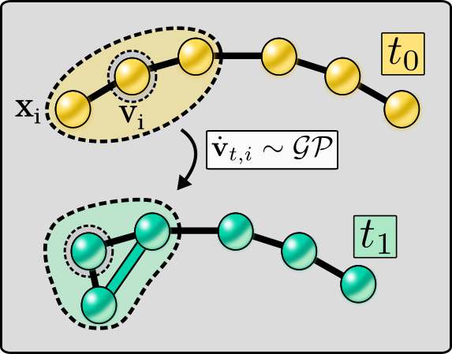
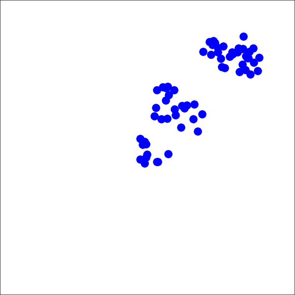

# Evolving-Graph Gaussian Processes

 

[Evolving-Graph Gaussian Processes](https://arxiv.org/abs/2106.15127) (e-GGPs) model the evolution of graph nodes via a GP.
The method uses a kernel that considers the neighbourhood and node attributes of the graph.
The **e-GGP** code provided here can be used for regression tasks on *dynamic graphs*.


If you find this code useful, please consider citing:
```
@article{blancomulero2021evolvinggraph,
      title={Evolving-Graph Gaussian Processes}, 
      author={David Blanco-Mulero and Markus Heinonen and Ville Kyrki},
      year={2021},
      journal={arXiv preprint arXiv:2106.15127},
      eprint={2106.15127},
      archivePrefix={arXiv},
      primaryClass={cs.LG}
}
```

## Model structure 
The repository contains the following:
- `e_ggp/evolving_gp.py` - e-GGP model.
- `e_ggp/kernels.py` - attributed sub-tree kernel used in e-GGP .
- `train_eggp.py` - script for training e-GGP using one of the given datasets.

The `e_ggp/kernels.py` file contains an implementation of the kernel used in the paper:
```math
k_{nn}(\mathbf{v}_i, \mathbf{v}_j) = \dfrac{1}{L} \sum\limits_{\mathbf{x}_i \in N_i^1}
\sum\limits_{\mathbf{x}_j \in N^1_j} k_l(\varphi_\mathbf{v}(\mathbf{x}_{i}), \varphi_\mathbf{v}(\mathbf{x}_{j})).
```
```math
K(\mathbf{v}_i,\mathbf{v}_j) = k_r(\varphi_\mathbf{v}(\mathbf{v}_{i}), \varphi_\mathbf{v}(\mathbf{v}_{j})) + k_{nn}(\mathbf{v}_i, \mathbf{v}_j).
```


We also provide utils that are used for selecting the training points, creating the datasets as well as plot utils in the folder `e_ggp/utils`.


## Requirements
The code is mainly based on [GPyTorch](https://gpytorch.ai/) and uses
[Python-igraph](https://igraph.org/python/) for defining the graphs.

To install the requirements you can run
```bash
pip install --user -r requirements.txt
```

## Usage
You can run the training for the graph interaction dataset with:
```bash
python3 train_eggp.py  -df datasets/graph_interaction_origin.npy
-dt datasets/graph_interaction_test/ --new_dataset
```

For an estimation of the **training time** we encourage you to have a look at the [paper](https://arxiv.org/abs/2106.15127)
Supplementary material section.

We provide a [Jupyter Notebook](examples/example_eggp_graph_interaction.ipynb) 
as well as more detailed [instructions](examples/train_and_test.md) on how to train the given
datasets using our model.

If you want to use your own dataset take a look at the `GraphInteraction` and
`IsolatedSubgraphs` classes which inherit from `GraphDataset` in
[datasets.py](e_ggp/utils/datasets.py).


## Environments
We provide the datasets of the two environments used in the paper in `datasets/`.

**Graph-Interaction environment** | **Isolated evolving sub-graphs environment**
------ | ------
   |  


The Graph-Interaction environment is based on [MuJoCo-Py](https://github.com/openai/mujoco-py).

The code for the isolated evolving sub-graphs environment can be found in
`environments/water_2d.py`.

The environment is based on [Taichi-MPM](https://github.com/yuanming-hu/taichi_mpm) 
and [Taichi-elements](https://github.com/taichi-dev/taichi_elements/)


